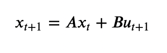

# Discrete time network control with Reinforcement Learning

Controlling complex (directed) networks using Reinforcement Learning frameworks. Problem is framed as discrete time
linear system over a finite (Galois) field, defined as:   


Where states and inputs of are over a finite field.

## Usage
```python
import numpy as np

from network_control_rl.rl import QLearning
from network_control_rl.algebra import BaseNumber
from network_control_rl.network import Network

network = Network()
network.from_edges([(0, 1), (1, 2), (2, 3)])  # Network can be build from (directed) links

input_matrix = {0: 0}  # mapping order of driver nodes
q = 4  # order of the finite field and base of the number system
n = network.nodes  # number of nodes / state vector size

initial_state = BaseNumber(n, q)
initial_state.from_array(np.array([1, 2, 3, 1]))
end_state = BaseNumber(n, q)
end_state.from_array(np.array([1, 3, 2, 1]))

model = QLearning(
    initial_state,
    end_state,
    network,
    input_matrix,
    num_episodes=50,
    max_iteration=10
)
model.train(seed=6)

model.get_signals(vector=True)
>>> array([[2], [3], [1]])  # ordered list of signals for each time step
```

## Development
In this repo we use a few tools to keep the code clean, styled and properly tested:
```shell
make lint  # runs flake8, Bandit and Black check
make format  # runs Black formating
make typecheck  # runs mypy
make test  # runs unit [py]tests
```

## References 
[1] Sutton, R. S., & Barto, A. G. (2018), _"Reinforcement Learning: An Introduction"_, The MIT Press.  
[2] Newman, M. E. J. (2010), _"Networks: an introduction"_, Oxford University Press, Oxford; New York  
[3] Diestel, R. (2002), _"Graph Theory, Springer"_, Volume 173 of Graduate texts in mathematics, ISSN 0072-5285  
[4] Brunton, S., & Kutz, J. (2019). _"Data-Driven Science and Engineering: Machine Learning"_, Dynamical Systems, and Control. Cambridge: Cambridge University Press. doi:10.1017/9781108380690   
[5] Liu, Y. Y., & Barabasi, A. L. (2016), _"Control Principes of Complex Networks"_, 10.1103/RevModPhys.88.035006  
[6] Liu, Y. Y., & Slotine, J. J., & Barabási, A. L. (2011), _"Controllability of complex networks"_. Nature 473, 167–173. https://doi.org/10.1038/nature10011  
[7] John Kerl, (2004), "Computation in finite fields", https://johnkerl.org/doc/ffcomp.pdf  

_This package was created with Cookiecutter from **[matejker](https://github.com/matejker) /** [cookiecutter-poetry](https://github.com/matejker/cookiecutter-poetry) project template._
